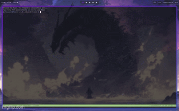

# CLI Fuzzy Finder



(Apologies this Gif is very low quality... will upload a better one in the future)

## Problem

- Where are my files, why do I have to ```cd``` into everything. Wouldn't it be nice to just fuzzy find my files. I need a
new project to complete
- You cannot easily change the working directory of a user using a C++ program. You will have to eventually, interact
  with the shell. Therefore, there must also be some form of configuration is the shells config with either:

  ```
  .bashrc
  OR
  .config/fish/config.fish
  ```


## Solution

Create a simple fuzzy finder for your files. And make script installation easy.

## How it's going to work

- Make a scoring algorithm for files
- The highest scores should be the files we are looking for
- Split the directory files into batches for multithreading
- Make it look pretty

## Scoring Algorithm

- Levenshtein did not work as intended and took too long to run.
- Moved to a scoring algorithm in which directory path names get reward based on different qualities.
    - Is the char included in the directory path
    - Detection of concurrent chars
    - Does the char exist after a separator/delimeter
    - Penalties apply for longer directories to ensure the smallest directory is returned first.

## Tech

Will be using C++. For the speed. Might try to add multithreading for no the memes.

## Implementation

- [x] Implement __ncurses__
- [x] Create new terminal Screen instead of using stdout
- [x] Get starting path using the C++ __FILESYSTEM__
- [x] Recursively get all other paths
- [x] Use multithreading to set up terminal and get directories simultaneously
- [x] Set up loop which runs on keystroke 
- [x] Enable function keys, arrows and scroll 
- [x] Split directories into chunks for __MULTITHREADING__
- [x] Use __MUTEX__ and locks to deal with raceconditions when fuzzy finding
- [x] Design Fuzzy Finding Scoring Algorithm
- [x] Implement Algorithm 
- [x] Set up Display 
- [x] Add Colour to show user search
- [x] Add icons to search

